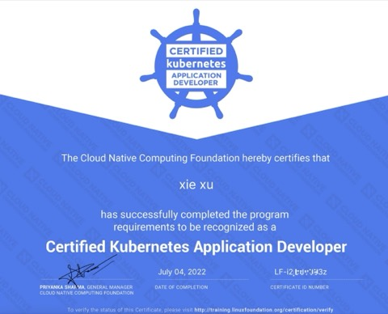

<h1 align="center">Hi, I'm ixugo</h1>

  <strong>Go · React · TypeScript · Flutter · AI</strong> 
  Software Engineer with <strong>7+ years</strong> of professional Go experience

  
  

---

## About Me

I'm a software engineer who genuinely loves **React, TypeScript, and Go** — not just as tools on a résumé, but as the technologies I reach for every day and build real things with.

- **7+ years of professional Go experience** designing and shipping backend systems, from domain-driven architectures to high-concurrency services.
- Deep hands-on experience with **React + TypeScript**, building performant, maintainable frontends.
- Actively exploring **AI engineering** — integrating LLMs into real products and workflows.
- Cross-platform mobile/desktop experience with **Flutter**.
- Daily work focuses on **streaming media systems** — GB28181, RTMP, RTSP, HLS, WebRTC, and FFmpeg.
- **I hate repetitive work.** When I see a task done twice, I build a tool or pipeline to automate it. Most of my side projects started exactly this way.
- Committed to **code quality and reusable design** — and I learn something new every single day.

## Open Source

| Project | Description |
| --- | --- |
| [**gowvp/owl**](https://github.com/gowvp/owl) | Open-source video surveillance / streaming platform built with Go — live streaming, recording, playback, and device management. |
| [**ixugo/goddd**](https://github.com/ixugo/goddd) | A practical Go project template for **Domain-Driven Design** — layered architecture, clean dependencies, ready for real production services. |

## Tech Stack

**Backend**

**Frontend**

**Mobile & Cross-platform**

**Streaming & Media**

**Operations**

**AI & Tooling**

## Learning

Learning never stops — this Kubernetes certification is one milestone from the journey.

  
Certificate

  

## Writing

I share what I learn on my blog: **[blog.golang.space](https://blog.golang.space/)** — mostly Go, architecture, and engineering practice.

---

  <i>"Automate the boring, design for reuse, learn every day."</i>

